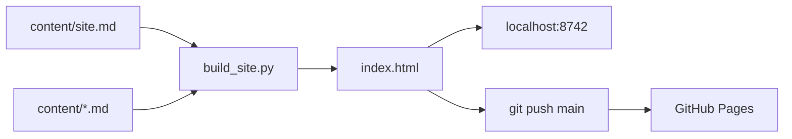

# HANDOFF — Treinamento POCUS UPA

## Objetivo

Site estático de trilha educacional (POCUS, Konted C10RL + My USG) para a equipe da UPA Satélite. Conteúdo editável em Markdown; HTML gerado por script Python.

## URLs

| O quê | Endereço |
|---|---|
| **Site público (GitHub Pages)** | https://diogene5.github.io/usg-treinamento/ |
| **Preview local** | http://localhost:8742/ (após `python3 -m http.server 8742`) |
| **Repositório** | https://github.com/diogene5/usg-treinamento |

## Estado atual (jun/2026)

- Layout **V3.1**: trilha em 4 etapas, 11 módulos, painel **Plantão** (dark).
- Textos do hero, etapas, senhas, links do app e rodapé: **`content/site.md`** (YAML no frontmatter).
- Rodapé **sem** instruções internas (“Como editar”, Obsidian, build) — só escopo + créditos SAEM.
- Senhas copiáveis na **Etapa 1** e no Plantão.
- **`08-roteiro-aula.md`** fica no vault, **não** entra no site.

## Como editar e publicar

```bash
cd /Users/diogenes/vaults/usg_treinamento

# 1. Edite content/site.md e/ou content/*.md da trilha
# 2. Gere o HTML
python3 scripts/build_site.py
# ou clique duplo em atualizar-site.command

# 3. Preview local
python3 -m http.server 8742 --directory .
# Abra http://localhost:8742/

# 4. Publicar (GitHub Pages na branch main)
git add content/site.md content/*.md scripts/build_site.py assets/site.css index.html
git commit -m "sua mensagem"
git push origin main
```

> GitHub Pages demora ~1–2 min para refletir o push.

## Onde editar o quê

| Arquivo | Controle |
|---|---|
| `content/site.md` | Hero, títulos das etapas, senhas, links App Store/Play, rodapé |
| `content/00-inicio.md` … `09-checklists.md` | Texto dos módulos |
| `scripts/build_site.py` | Estrutura da trilha, template HTML (evitar para textos) |
| `assets/site.css`, `assets/site.js` | Visual e interações |
| `99-como-editar-publicar.md`, `walkthrough.md` | Só vault — não vão pro site |

## Abrir no Codex ou Claude Code

### Codex (CLI / IDE)

1. Abra a pasta do projeto:
   ```bash
   cd /Users/diogenes/vaults/usg_treinamento
   ```
2. No Codex, aponte o workspace para esse caminho (mesmo vault Obsidian).
3. Leia **`HANDOFF.md`** (este arquivo) e **`content/site.md`** antes de pedir mudanças.
4. Prompt útil:
   > Edite o site POCUS UPA. Textos em `content/*.md` e `content/site.md`. Depois rode `python3 scripts/build_site.py`. Não exponha instruções de dev no HTML público.

### Claude Code

1. Inicie na pasta:
   ```bash
   cd /Users/diogenes/vaults/usg_treinamento && claude
   ```
   (ou abra a pasta no Claude Code / Cursor com essa raiz.)
2. Referencie `@HANDOFF.md` e `@content/site.md` no primeiro prompt.
3. Para publicar, peça explicitamente: commit + `git push origin main`.

### Cursor (onde você está agora)

- Abrir arquivos: `content/site.md` + módulos em `content/`.
- Terminal: `python3 scripts/build_site.py` → `open http://localhost:8742/`.

## Validação

- [ ] `python3 scripts/build_site.py` sem erro
- [ ] `index.html` **não** contém: `Como editar`, `Obsidian`, `source-path`, `build_site`
- [ ] Etapa 1 mostra senhas Wi-Fi e app + botões das lojas
- [ ] Rodapé: escopo + créditos SAEM apenas
- [ ] https://diogene5.github.io/usg-treinamento/ atualizado após push

## Branch e remoto

- Branch: `main`
- Remote: `origin` → `https://github.com/diogene5/usg-treinamento.git`
- Variáveis de ambiente: **nenhuma** (site estático, zero dependências pip)

## Árvore (essencial)

```
usg_treinamento/
├── content/           # Markdown — edite aqui
│   ├── site.md        # painel do site (YAML)
│   └── *.md           # módulos da trilha
├── scripts/
│   └── build_site.py  # gera index.html
├── assets/
│   ├── site.css
│   ├── site.js
│   ├── fonts/
│   └── media/
├── index.html         # gerado — não editar à mão
├── atualizar-site.command
└── HANDOFF.md         # este arquivo
```

## Fluxo (diagrama)



## Flashcards

**P:** Onde mudo o título do hero?  
**R:** `content/site.md` → `hero_titulo` / `hero_destaque`.

**P:** Onde mudo senhas?  
**R:** `content/site.md` → `senha_wifi`, `senha_app`.

**P:** Como vejo antes de publicar?  
**R:** `python3 scripts/build_site.py` + `python3 -m http.server 8742` → http://localhost:8742/

**P:** URL pública?  
**R:** https://diogene5.github.io/usg-treinamento/
