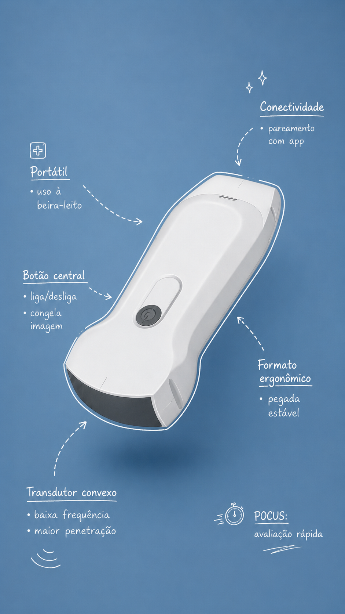

# POCUS UPA: Konted C10RL + My USG

Material de referência para uma primeira turma de médicos e enfermeiros de UPA usando o aparelho **USG Konted C10RL** com o app **My USG**.

## Objetivo da primeira aula

Ao final da aula, a equipe deve conseguir:

- cuidar do aparelho antes, durante e depois do plantão;
- ligar, carregar, conectar e reconhecer falhas comuns;
- abrir o My USG, fazer login, conectar à sonda e gerar uma imagem teste;
- ajustar profundidade, ganho, foco, preset e orientação;
- entender o que é POCUS: exame focado para responder uma pergunta clínica imediata;
- reconhecer quando o exame está limitado e quando chamar alguém mais experiente.

## Ordem recomendada

1. Segurança, limpeza, bateria, gel e armazenamento.
2. Aparelho C10RL: faces convexa/linear, botão físico, porta Type-C e indicadores.
3. Conexão no My USG: Wi-Fi, senha da sonda, senha inicial do app e problemas comuns.
4. Imagem básica: marcador, profundidade, ganho, TGC, foco, congelar, salvar.
5. Protocolos de UPA: eFAST, pulmão, bexiga/rim, partes moles, vascular e acesso venoso.
6. Armadilhas: imagem bonita com pergunta ruim, Doppler mal ajustado, falso positivo/negativo.
7. Treino prático supervisionado.

## Regra central

POCUS não é “fazer ultrassom completo”. É responder uma pergunta clínica limitada, no leito, com documentação clara do que foi visto e do que não foi visto.
