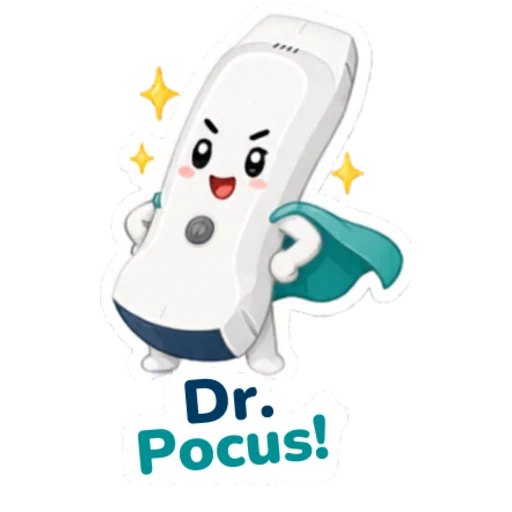

# Treinamento de USG point-of-care

Material de consulta para a equipe da **UPA** usar o **Konted C10RL** com o app **My USG**: ligar, conectar, gerar uma imagem básica, reconhecer limitações e pedir ajuda cedo.

O objetivo inicial não é formar especialista em ultrassom. É fazer todo mundo conseguir:

1. baixar o aplicativo correto;
2. conectar o celular ou tablet ao aparelho;
3. cuidar do equipamento antes e depois do uso;
4. gerar uma imagem básica;
5. reconhecer quando a imagem ou o exame estão limitados;
6. chamar ajuda quando necessário.

> O aparelho é para uso da equipe. Quem trabalha na UPA precisa saber conectar, cuidar e usar com responsabilidade.

## O que é POCUS

POCUS é ultrassom feito à beira-leito por quem está cuidando do paciente, com uma pergunta clínica limitada e imediata.

| Não é | É |
|---|---|
| exame completo de radiologia | resposta focada no contexto clínico |
| laudo definitivo isolado | dado adicional para decisão imediata |
| imagem bonita para arquivo | imagem suficiente para responder uma pergunta |
| substituto de reavaliação | ferramenta integrada ao exame físico e evolução |

## Antes da aula

- Baixe o app **My USG**.
- Leve o celular ou tablet com bateria.
- Anote a senha do Wi-Fi da sonda desta unidade: **`uxccgdh397`** (iPhone, iPad e Android).
- Se puder, abra o app uma vez antes do treinamento.
- Consulte o [manual oficial C10RL + My USG](../references/c10rl-pro-myusg-quick-user-manual-v1-1.pdf) se quiser ler antes.
- Não precisa decorar protocolos antes da primeira prática.

## Regras simples de segurança

- POCUS responde uma pergunta clínica específica; não substitui avaliação completa.
- Não atrase reanimação ou conduta urgente para procurar imagem perfeita.
- Se a imagem estiver ruim ou o exame for limitado, diga isso claramente.
- Limpe e guarde o aparelho depois de usar.

## Como estudar depois

Use este site como roteiro rápido. Para aprofundar, vá direto à página **Fontes FOAM** no final: ali estão guias, atlas de imagens, vídeos e referências abertas para consulta.
