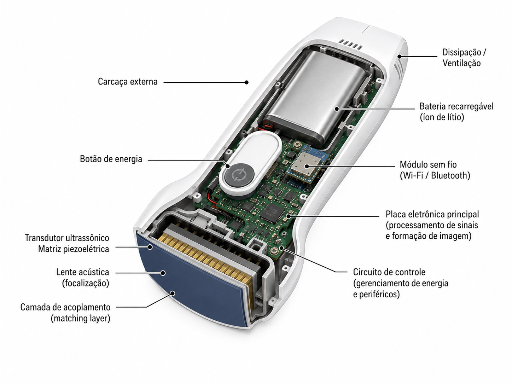

# Aparelho C10RL

O material local identifica o aparelho como **Konted C10RL**, sonda dupla com cabeça **convexa/cardíaca** e **linear**, conectada ao app **My USG**.

## Componentes que a equipe deve reconhecer

- **Marca de orientação**: deve ser alinhada com o marcador da tela.
- **Marca central/mid-line**: ajuda a centralizar o alvo.
- **Botão físico**: liga, congela/retorna ao vivo e alterna a cabeça ativa conforme tempo de pressão.
- **Porta Type-C**: usada para cabo/recarga conforme dispositivo e cabo correto.
- **Indicadores de bateria**: observar antes de sair para atendimento.
- **Cabeça convexa**: abdome, bexiga, rim, eFAST, pulmão profundo e avaliação cardíaca limitada.
- **Cabeça linear**: partes moles, vascular, acesso venoso, nervo, tireoide, estruturas superficiais.

## Especificações úteis para aula

| Item | Informação prática |
|---|---|
| Conexão | Wi-Fi e USB/Type-C conforme dispositivo e cabo compatível |
| App | My USG |
| Modos | B, B/M, Color, PDI, PW e combinações conforme preset/cabeça |
| Linear | 7,5/10 MHz; profundidades superficiais, como 20 a 100 mm nos PDFs locais |
| Convexa/cardíaca | baixa frequência; profundidades maiores, como 90 a 305 mm nos PDFs locais |
| Bateria | bateria interna; PDFs locais citam cerca de 2800 mAh e uso em torno de 3 horas |
| Idioma | há suporte a português do Brasil nos PDFs comerciais locais |

## Botão físico

- Pressionar para ligar.
- Manter pressionado para desligar.
- Pressão intermediária alterna a cabeça de varredura em modelos de dupla cabeça.
- Se não desligar, o manual orienta segurar o botão por 15 a 20 segundos.

## Antes de levar para a sala

- Conferir carga.
- Conferir se a tampa/vedação da porta está adequada antes de limpeza.
- Conferir se há gel suficiente.
- Conferir se o celular/tablet já tem My USG instalado.
- Fazer um teste rápido de conexão antes da turma chegar.

## Fontes locais

- [Manual rápido My USG USB/Wi-Fi](../references/myusg-quick-user-guide-usb-wifi-probe.pdf)
- [Manual C10RL Pro + My USG](../references/c10rl-pro-myusg-quick-user-manual-v1-1.pdf)
- [PDF C10RL double head wireless ultrasound](../references/c10rl-double-head-wireless-ultrasound.pdf)
- [PDF comercial C10RL 3 in 1 Color Doppler](../references/c10rl-3-in-1-color-doppler-ultrasound.pdf)
