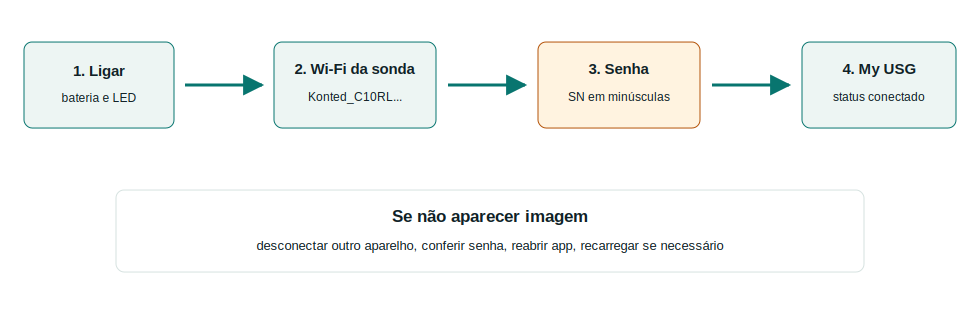

# Conexão My USG

A conexão deve ser feita sempre na mesma ordem. O ponto mais importante dos manuais locais é: a senha do Wi-Fi da sonda é o **número de série da sonda em letras minúsculas**.

## Primeiro acesso ao app

Se o My USG pedir login:

1. toque em **Administer**;
2. use a senha inicial **123456**;
3. se fizer sentido para o treinamento, ative **Auto login**;
4. confirme e vá para a tela de exame.

{{video:../assets/media/myusg-senha-autologin.mp4|Vídeo local: senha inicial 123456 e auto login no My USG|../assets/media/myusg-senha-autologin-thumb.png}}

## Wi-Fi da sonda

1. Ligue a sonda.
2. Aguarde os indicadores de bateria/funcionamento.
3. No celular/tablet, abra Wi-Fi.
4. Selecione a rede da sonda.
5. Digite a senha usando o SN em minúsculas, sem espaços.
6. Abra o My USG.
7. Confirme que a sonda aparece conectada.
8. Coloque gel e gere imagem teste em modo B.

## Se não funcionar

| Problema | Solução prática |
|---|---|
| Wi-Fi da sonda não aparece | ligar, carregar alguns minutos e aproximar o celular/tablet |
| Senha recusada | redigitar o SN todo em minúsculas, sem espaços |
| App pede senha | usar `123456` em Administer |
| Wi-Fi conecta, mas não sai imagem | fechar/abrir app, selecionar sonda e desconectar outro aparelho |
| Imagem trava | aproximar aparelho, reiniciar sonda/app e checar bateria |
| Cabo não funciona | no iPhone, prefira Wi-Fi; no Android, testar cabo/orientação compatível |
