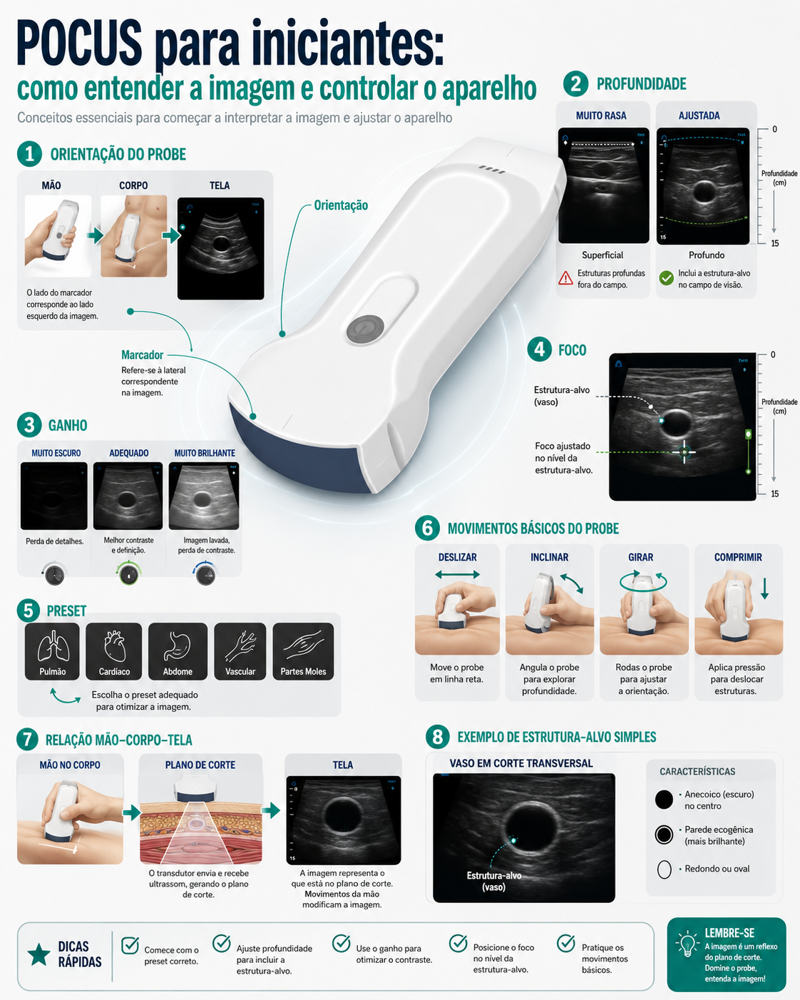

# Controles de imagem

Não tente fazer uma imagem perfeita. Primeiro faça uma imagem útil para responder a pergunta clínica.

## Ajuste básico

1. Escolha a face correta: convexa para profundo, linear para superficial.
2. Escolha preset próximo da região.
3. Coloque gel suficiente.
4. Ache a estrutura em modo B.
5. Ajuste profundidade.
6. Ajuste ganho.
7. Ajuste foco se necessário.
8. Congele e salve quando a imagem responder a pergunta.

## Controles mais usados

| Controle | Para que serve |
|---|---|
| Preset | ponto de partida para órgão/estrutura |
| Gain/GN | clarear ou escurecer a imagem |
| Depth/D | aumentar ou reduzir profundidade |
| TGC | ajustar ganho por profundidade |
| Focus | colocar foco no alvo |
| Freeze/Live | congelar ou voltar ao vivo |
| Save image/video | registrar imagem ou clipe |

## Erro comum

Se a imagem está ruim, não mexa só no ganho. Confira gel, contato, face correta, preset, profundidade e orientação.
