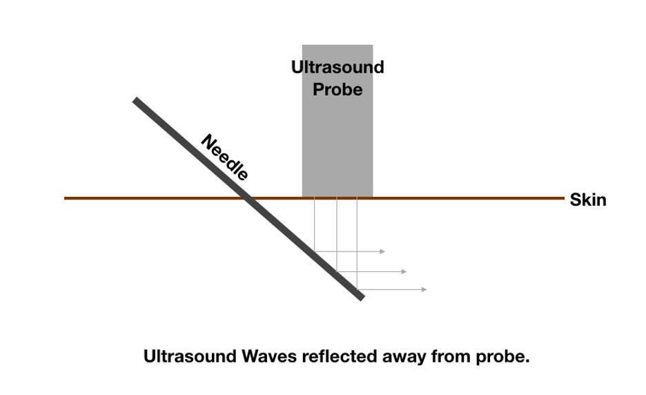
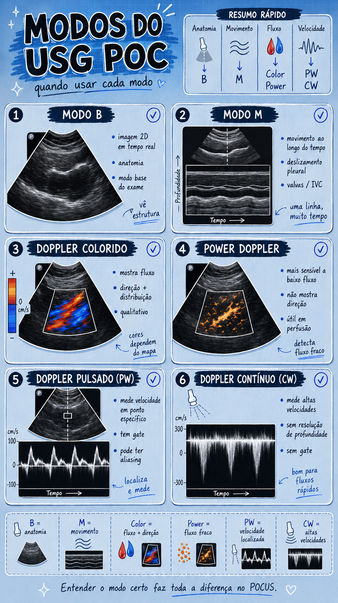
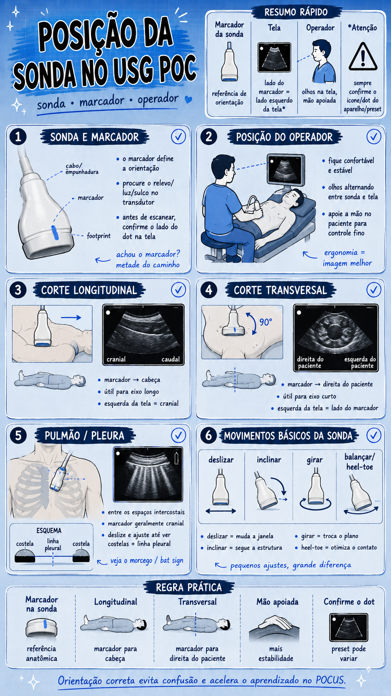
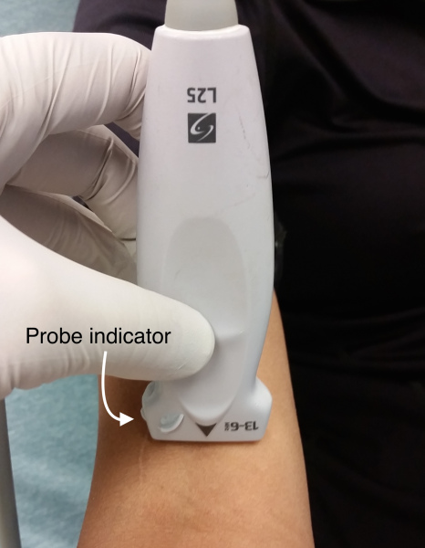

# Controles de imagem

Não tente fazer uma imagem perfeita. Primeiro faça uma imagem útil para responder a pergunta clínica.

## Princípios da ultrassonografia

O transdutor emite som, recebe ecos e transforma o retorno em pontos na tela. Eco forte fica branco; eco fraco fica cinza; líquido costuma ficar preto.

| Termo | Como aparece | Exemplos |
|---|---|---|
| Anecoico | preto | sangue, urina, cisto, derrame |
| Hipoecoico | cinza escuro | músculo, tecido inflamado |
| Hiperecoico | branco | osso, pleura, agulha, cálculo |
| Sombra | escuro atrás de algo branco | osso ou cálculo bloqueando o feixe |
| Reforço posterior | brilho atrás de líquido | bexiga, cisto, vesícula |

Regra prática: **líquido é preto, osso/agulha são brancos, ar atrapalha**. Por isso gel importa.

## Ajuste básico

1. Escolha a face correta: convexa para profundo, linear para superficial.
2. Escolha preset próximo da região.
3. Coloque gel suficiente.
4. Ache a estrutura em modo B.
5. Ajuste profundidade.
6. Ajuste ganho.
7. Ajuste foco se necessário.
8. Congele e salve quando a imagem responder a pergunta.

>  **Imagem útil** — não precisa ser perfeita; precisa responder a pergunta.

## Controles mais usados

| Controle | Para que serve |
|---|---|
| Preset | ponto de partida para órgão/estrutura |
| Gain/GN | clarear ou escurecer a imagem |
| Depth/D | aumentar ou reduzir profundidade |
| TGC | ajustar ganho por profundidade |
| Focus | colocar foco no alvo |
| Freeze/Live | congelar ou voltar ao vivo |
| Save image/video | registrar imagem ou clipe |

## Movimentos da sonda

| Movimento  | Para que serve                                   |
| ---------- | ------------------------------------------------ |
| Deslizar   | procurar a melhor janela                         |
| Inclinar   | varrer o órgão sem perder o ponto de contato     |
| Rotacionar | mudar eixo curto para eixo longo                 |
| Bascular   | centralizar o alvo                               |
| Comprimir  | diferenciar veia de artéria, testar partes moles |

>  **Janela** = ponto em que o ultrassom enxerga bem. Deslizar é procurar essa janela.

## Orientação

O marcador físico da sonda precisa corresponder ao marcador da tela. Se estiver em dúvida, faça o “teste do dedo”: coloque um dedo em uma das extremidades do transdutor e veja qual lado da tela se mexe.

## Erro comum

Se a imagem está ruim, não mexa só no ganho. Confira gel, contato, face correta, preset, profundidade e orientação.
