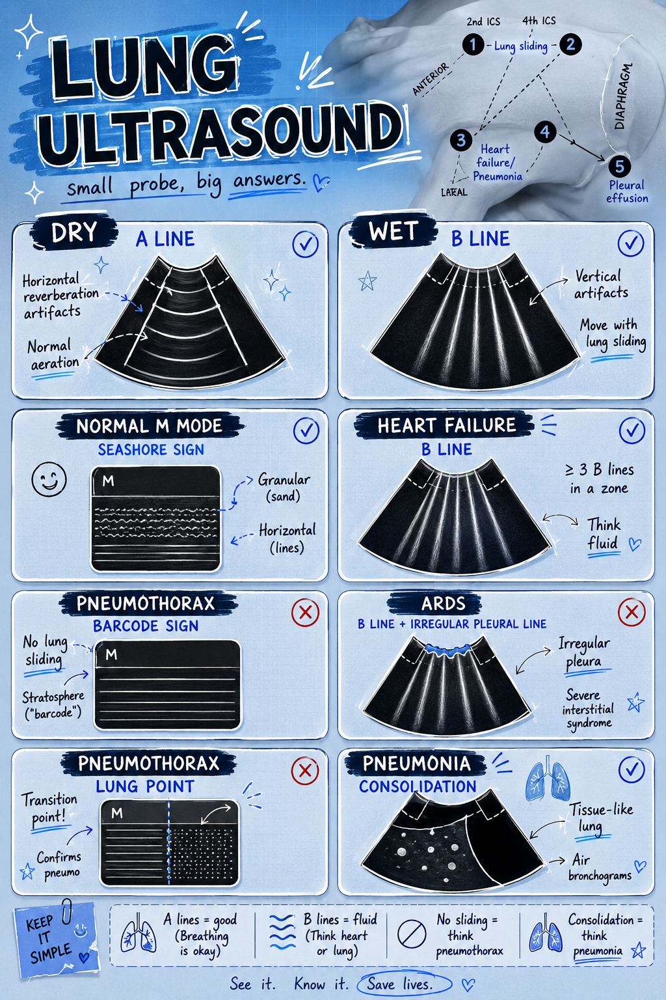

# Protocolos POCUS para UPA

A primeira turma não precisa sair fazendo laudo completo. Ela precisa aprender perguntas clínicas seguras, repetíveis e úteis para emergência.

## Módulos desta primeira versão

| Módulo | Status na primeira aula | Transdutor |
|---|---|---|
| Acesso central | foco prático/cognitivo | linear |
| Pulmão | demonstração, não competência mínima | linear ou convexa |
| eFAST/FAST | demonstração, não competência mínima | convexa/cardíaca e linear para pleura se disponível |
| Eco básico | demonstração, não competência mínima | convexa/cardíaca |
| Volume vesical | menção básica | convexa |
| Acesso periférico | apêndice | linear |

O foco operacional é acesso central: pré-scan, jugular interna, femoral como comparação, veia vs artéria, eixo curto/eixo longo, ponta da agulha e supervisão.

## Pulmão

Perguntas úteis na UPA:

- há deslizamento pleural no ponto avaliado?
- há linhas B difusas?
- há derrame pleural?
- há consolidação subpleural evidente?

Procure primeiro a linha pleural entre duas sombras de costelas. Ajuste a profundidade para não deixar metade da tela mostrando imagem que não é do nosso interesse.

| Achado           | Interpretação prática                 | Armadilha                                                            |
| ---------------- | ------------------------------------- | -------------------------------------------------------------------- |
| Sliding presente | ausência de pneumotórax naquele ponto | não avalia o pulmão inteiro                                          |
| Sliding ausente  | pode ocorrer em pneumotórax           | também ocorre em apneia, intubação seletiva, pleurodese, atelectasia |
| Linhas A         | padrão horizontal repetido            | pode ser normal ou hiperinsuflação                                   |
| B-lines difusas  | síndrome intersticial                 | causa depende do contexto clínico                                    |
| Derrame          | líquido pleural                       | não confundir com fígado/baço/atelectasia                            |

## eFAST inicial

Janelas mínimas:

1. quadrante superior direito;
2. quadrante superior esquerdo;
3. pelve;
4. janela cardíaca se indicada e possível;
5. pleura anterior para pneumotórax.

Treine primeiro anatomia normal. No trauma instável, o objetivo é reconhecer líquido livre grosseiro e pneumotórax provável, sem atrasar conduta.

| Janela          | O que procurar                                          | Dica                               |
| --------------- | ------------------------------------------------------- | ---------------------------------- |
| HCD             | líquido entre fígado/rim, ponta hepática, base torácica | vá alto e posterior                |
| HCE             | líquido entre baço/rim e subdiafragmático               | geralmente é mais difícil que HCD  |
| Pelve           | líquido atrás da bexiga                                 | bexiga cheia ajuda                 |
| Cardíaca        | derrame pericárdico/atividade                           | se janela ruim, registre limitação |
| Pleura anterior | deslizamento pleural                                    | compare os lados                   |

FAST negativo não exclui lesão abdominal. Exame limitado deve ser dito como limitado.

## Bexiga e rim

Use convexa. Comece pela bexiga se a queixa é retenção, anúria, dor hipogástrica ou dificuldade de sondagem.

| Pergunta | Achado útil | Armadilha |
|---|---|---|
| Bexiga cheia? | estrutura anecoica arredondada na pelve | bexiga vazia não exclui problema se janela foi ruim |
| Hidronefrose grosseira? | dilatação anecoica no sistema coletor | vasos renais/cistos podem confundir |
| Sonda vesical está drenando? | bexiga ainda cheia apesar da sonda | avaliar posição e obstrução conforme protocolo |

## Partes moles

- Celulite: padrão em casca de laranja/cobblestoning.
- Abscesso: coleção hipoecoica/complexa, geralmente compressível ou com reforço posterior.
- Cuidado com vasos antes de drenagem.

Antes de incisar ou puncionar, varra a área em dois eixos. Se houver dúvida entre coleção e vaso, use compressão e Doppler quando disponível.

>  **Antes de furar:** olhe em dois eixos, explore ao redor e confirme que não é vaso.

## Procedimentos guiados

Regra única para iniciante: **não avance punção se a ponta da agulha não está visível**.

| Procedimento               | Antes de puncionar                   | Durante                             |
| -------------------------- | ------------------------------------ | ----------------------------------- |
| Acesso periférico          | diferenciar veia/artéria             | rastrear ponta da agulha            |
| Drenagem superficial       | confirmar coleção e profundidade     | evitar vasos e estruturas profundas |
| Corpo estranho superficial | confirmar localização e profundidade | marcar pele e planejar trajeto      |

## Acesso vascular

- Primeiro identificar artéria e veia.
- Confirmar compressibilidade da veia.
- Usar eixo curto ou longo conforme habilidade.
- A regra de segurança é ver a ponta da agulha antes de avançar.

## Documentação mínima

- Pergunta clínica.
- Janela(s) avaliada(s).
- Achado positivo/negativo.
- Limitação do exame.
- Conduta que mudou ou não mudou.

Frase segura: “POCUS realizado para pergunta direcionada. Achados interpretados no contexto clínico. Exame limitado por janela/tempo/colaboração quando aplicável.”
