# Acesso central guiado por USG

Nesta primeira versão, o objetivo não é ensinar punção central independente. O objetivo é criar base segura para **pré-scan, anatomia ultrassonográfica, escolha do alvo e prática supervisionada**.

Competência mínima: reconhecer veia, artéria, profundidade, relação anatômica e limites do exame. Procedimento real exige supervisão direta e protocolo local.

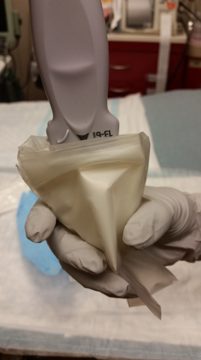

## Foco da aula

| Item              | Decisão                             |
| ----------------- | ----------------------------------- |
| Sítio principal   | jugular interna                     |
| Sítio secundário  | femoral                             |
| Subclávia/axilar  | apenas menção conceitual            |
| Acesso periférico | mencionar princípios                |
| Volume vesical    | menção básica, não módulo principal |

## Pré-avaliação obrigatório

Antes de iniciar qualquer procedimento, avalie antes com o usg:

1. Confirme que a veia está presente.
2. Avalie compressibilidade.
3. Diferencie veia de artéria.
4. Veja relação veia-artéria.
5. Estime profundidade.
6. Procure trombo ou colapso importante.
7. Escolha o melhor lado/sítio.
8. Só então avance para preparo conforme protocolo local.

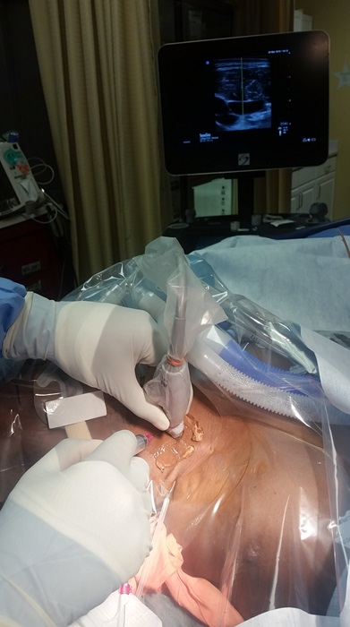

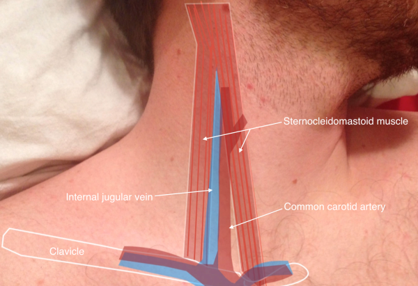

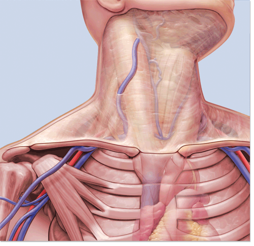

## Primeiro: artéria ou veia?

| Achado | Veia | Artéria |
|---|---|---|
| Compressão | colaba | não colaba ou colaba pouco |
| Forma | oval, variável | redonda, parede mais espessa |
| Pulsação | ausente ou transmitida | pulsátil |
| Doppler | fluxo venoso | fluxo pulsátil |
| Profundidade | varia com volemia/posição | geralmente mais estável |

>  Compressão primeiro. Na dúvida: 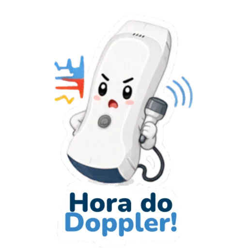

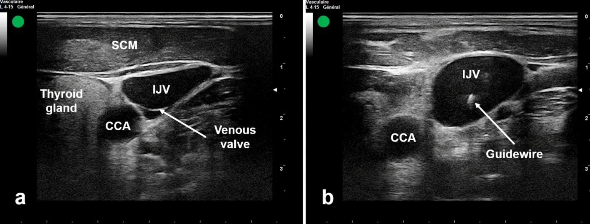

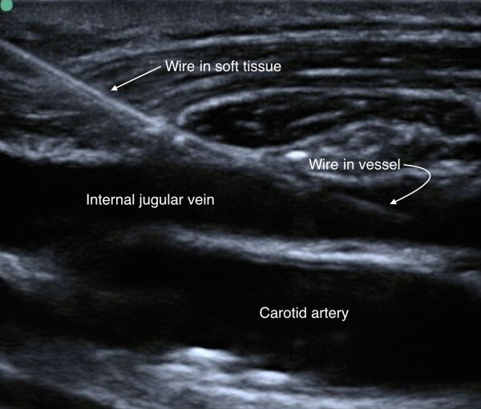

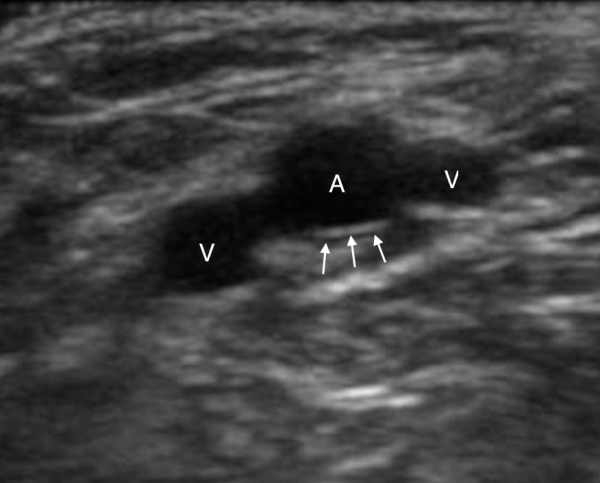

## Eixo curto e eixo longo

| Técnica | Melhor uso | Risco |
|---|---|---|
| Eixo curto / fora do plano | reconhecer anatomia, lateralidade e relação veia-artéria | confundir corpo da agulha com ponta |
| Eixo longo / no plano | entender trajeto e confirmar fio/agulha no vaso | perder o plano e achar que está dentro quando está lateral |

Use ambos como linguagem visual. Não transforme um deles em regra universal. Para iniciante, o ponto crítico é: **se a ponta sumiu, pare**.

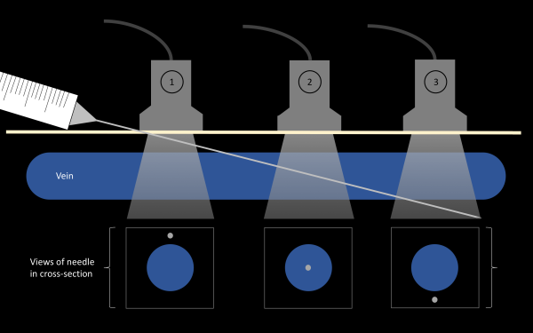

## Jugular interna

A avaliação prévia da jugular deve responder:

- A veia é visível?
- A veia colaba com compressão leve?
- A carótida está medial, posterior ou parcialmente sobreposta?
- A veia está grande o suficiente?
- Há trombo?
- A profundidade permite avançar com segurança?
- O melhor ponto muda ao varrer proximal/distal?

Se a jugular estiver pequena, colabada, trombosada, sobreposta à carótida ou difícil de manter na imagem, não force. Reavalie lado e peça ajuda.

## Femoral

Femoral entra como comparação e alternativa, não como foco principal inicial.

Lembrete prático: na região femoral, a veia costuma estar medial à artéria, mas a anatomia deve ser confirmada em tempo real. Compressibilidade e Doppler ajudam quando houver dúvida.

## Regra da ponta e do fio

Durante prática supervisionada:

- não avance sem saber onde está a ponta;
- se a ponta sumiu, pare;
- reencontre a ponta antes de avançar;
- confirme fio no vaso antes de dilatar;
- se não consegue confirmar, peça ajuda e não prossiga.

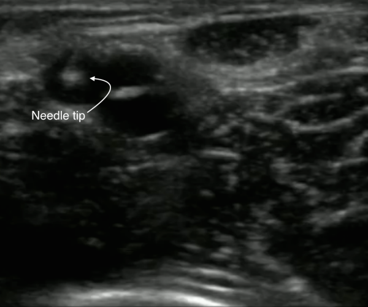

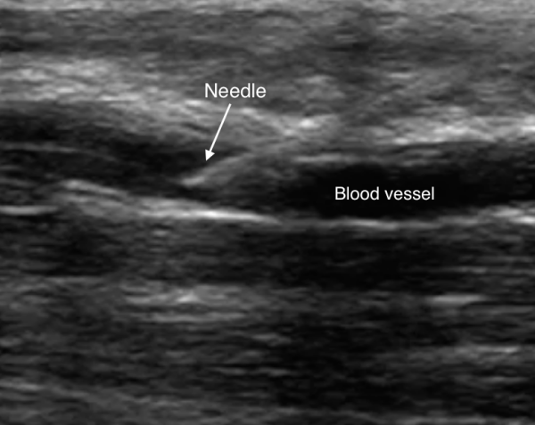

## Acesso periférico 

O acesso periférico guiado por USG será apenas mencionado nesta etapa:

- identificar veia e artéria;
- confirmar compressibilidade;
- praticar coordenação mão-sonda-agulha;
- não avançar sem ponta visível.

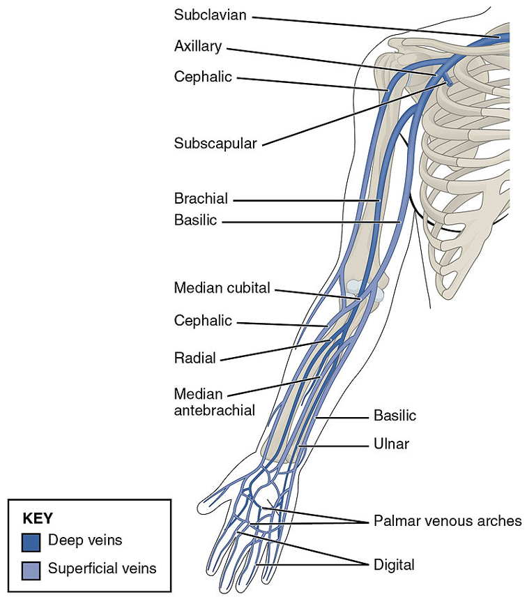

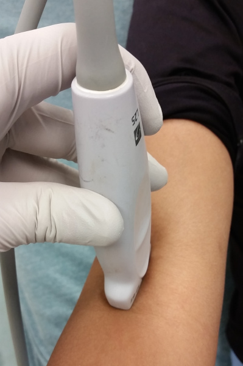

## Volume vesical 

Volume vesical entra como demonstração simples:

`comprimento x largura x altura x 0,52`

Exemplo ilustrativo: `10 cm x 8 cm x 6 cm x 0,52 = aproximadamente 250 mL`.

Use como estimativa prática, não como medida absoluta.
