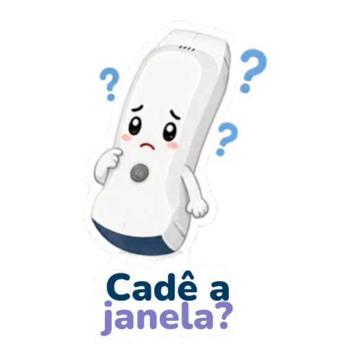

# Checklists rápidos

Esta página é para usar na hora da aula, no início do plantão ou quando o aparelho “não quer funcionar”.

## Antes da aula

- Sonda carregada.
- Celular/tablet carregado.
- My USG instalado.
- Senha Wi-Fi da sonda: **`uxccgdh397`** (desta unidade).
- Senha inicial do app lembrada: `123456` para Administer.
- Gel disponível.
- Papel/pano macio disponível.
- Produto de limpeza institucional disponível.
- Teste de imagem feito antes da turma chegar.
- Um segundo celular/tablet separado para contingência.

## Conexão

1. Ligar a sonda.
2. Entrar no Wi-Fi da sonda.
3. Usar senha **`uxccgdh397`** (minúsculas, sem espaços).
4. Abrir My USG.
5. Fazer login como Administer se necessário.
6. Selecionar a sonda no app.
7. Gerar imagem teste.
8. Ajustar profundidade e ganho.
9. Congelar e salvar uma imagem.

>  Passou no teste? Siga para a prática.

## Imagem ruim

| Checar | Correção rápida |
|---|---|
| Sem gel | colocar gel suficiente |
| Sonda invertida | conferir marcador físico e marcador da tela |
| Profundidade excessiva | reduzir até o alvo ocupar a tela |
| Ganho alto/baixo | ajustar até separar líquido, tecido e osso |
| Preset inadequado | trocar para vascular, abdome, pulmão ou partes moles |
| Alvo fora do centro | deslizar, inclinar e centralizar |

## Segurança clínica

- POCUS responde pergunta focada.
- Exame ruim não vira exame normal.
- Achado negativo não substitui reavaliação.
- Procedimento só avança com ponta visível.
- Toda limitação deve ser verbalizada e registrada.
- Em paciente instável, POCUS não deve atrasar intervenção essencial.

## Limpeza pós-uso

1. Remover gel.
2. Limpar com pano macio/produto aprovado pela instituição.
3. Secar.
4. Inspecionar transdutor e carcaça.
5. Recarregar.
6. Guardar no local definido.

## Entrega mínima do aluno

Ao fim da prática, cada participante deve demonstrar:

- ligar a sonda;
- conectar no My USG;
- gerar imagem em modo B;
- ajustar profundidade e ganho;
- congelar e salvar;
- explicar uma limitação do exame;
- limpar e guardar corretamente.
