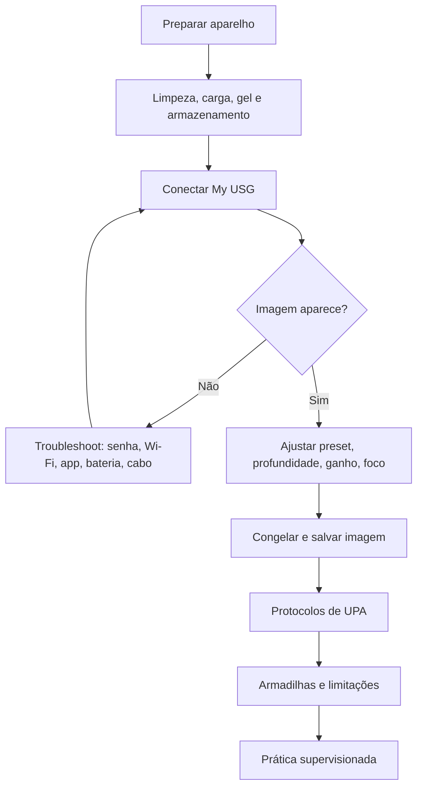

# Fluxo do treinamento

```mermaid
flowchart TD
  A[Preparar aparelho] --> B[Limpeza, carga, gel e armazenamento]
  B --> C[Conectar My USG]
  C --> D{Imagem aparece?}
  D -- Não --> E[Troubleshoot: senha, Wi-Fi, app, bateria, cabo]
  E --> C
  D -- Sim --> F[Ajustar preset, profundidade, ganho, foco]
  F --> G[Congelar e salvar imagem]
  G --> H[Protocolos de UPA]
  H --> I[Armadilhas e limitações]
  I --> J[Prática supervisionada]
```
